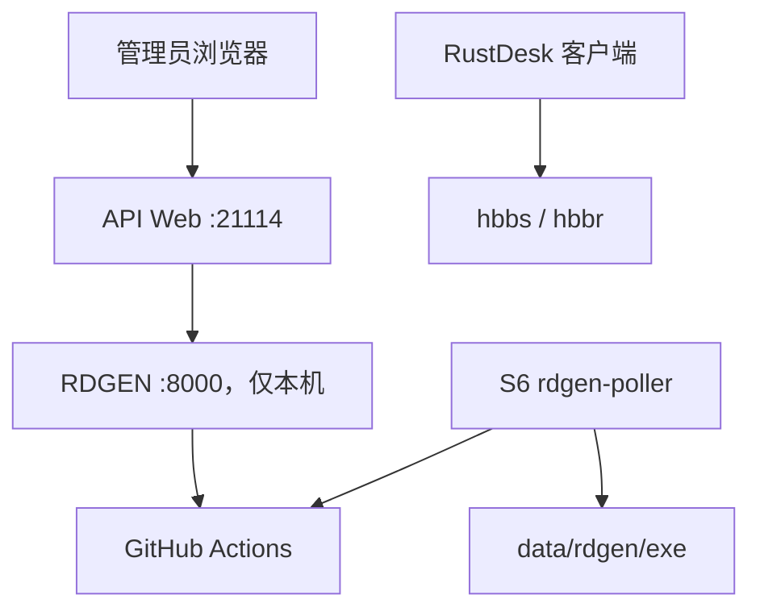

# RustDesk Full S6 + API + RDGEN

[English](README_EN.md) · [Full S6 部署文档](docs/full-s6-generator.md) · [问题反馈](https://github.com/AllenMGu/rustdesk-api/issues)

[](https://github.com/AllenMGu/rustdesk-api/actions/workflows/build.yml)
[](LICENSE)
[](rdgen/LICENSE)

这是一个面向自托管场景的 RustDesk 一体化仓库。`full-s6-generator`
镜像在同一个 S6 容器中运行 RustDesk Server、RustDesk API、Web 管理后台和
RDGEN 客户端生成器，并通过 GitHub Actions 生成 Windows、Linux、Android
与 macOS 客户端。

> **来源声明：本项目的 Full S6 容器与服务编排基于 [lejianwen/rustdesk-server](https://github.com/lejianwen/rustdesk-server/tree/forapi) 的 S6-overlay 方案，原始镜像为 [`lejianwen/rustdesk-server-s6`](https://hub.docker.com/r/lejianwen/rustdesk-server-s6)。**  
> API 核心来源于
> [lejianwen/rustdesk-api](https://github.com/lejianwen/rustdesk-api)，客户端生成器来源于
> [bryangerlach/rdgen](https://github.com/bryangerlach/rdgen)。本仓库在这些项目基础上完成了
> Full S6 整合、RDGEN 单仓化、安全加固、多平台 GitHub Actions 构建和
> Artifact 主动拉取。它不是 RustDesk 官方项目。

## 项目组成

| 组件 | 作用 | 运行方式 |
|---|---|---|
| `hbbs` | RustDesk ID/信令服务 | S6 服务 |
| `hbbr` | RustDesk 中继服务 | S6 服务 |
| RustDesk API | 登录、地址簿、设备、审计、LDAP/OAuth 等 API | S6 服务，端口 `21114` |
| Web Admin / Web Client | 管理后台和浏览器远程入口 | 由 API 提供 |
| RDGEN | 客户端参数配置、任务管理、安装包下载 | 内部 S6 服务，仅监听 `127.0.0.1:8000` |
| `rdgen-poller` | 查询 Actions、下载并验证 Artifact | S6 后台服务 |
| GitHub Actions | 编译各平台 RustDesk 客户端 | GitHub 托管 Runner |



## 主要功能

### RustDesk API 与管理后台

- RustDesk 客户端登录、个人地址簿、共享地址簿、群组和标签。
- 用户、设备、地址簿、群组和 OAuth 管理。
- 登录日志、连接日志和文件传输日志。
- LDAP 登录，已用于 Active Directory 和 OpenLDAP 场景；LDAP 验证失败时可回退到本地用户。
- GitHub、Google 和通用 OIDC 登录。
- Web Client 自动获取 API、ID Server、Relay Server、公钥和地址簿。
- 管理员临时分享 Web Client 连接。
- Swagger API 文档和服务器命令管理。
- CLI 重置管理员密码。

### 集成客户端生成器

- 生成器已经合并到本仓库的 `rdgen/`，不再依赖单独的 `AllenMGu/rdgen` 仓库。
- 生成入口位于 API 管理后台的 `系统管理 → 客户端生成器`。
- 生成任务、状态、安装包下载和删除均复用 API 管理员登录。
- 构建配置加密后以 Git blob 传入 Actions，不通过 URL 或 Shell 环境直接拼接敏感表单内容。
- GitHub Actions 不回连 S6；服务器主动查询、下载和验证 Artifact。
- 无需 `GENURL`、公网回调地址、入站 NAT 或 self-hosted runner。
- 支持配置自定义服务器、API 地址、公钥、应用名称、公司名称、文件名、图标、Logo 和永久密码等参数。

## 支持的客户端

| 平台 | 架构 | 主要产物 |
|---|---|---|
| Windows | x86_64、x86 | EXE、MSI |
| Android | aarch64、armv7、x86_64 | APK |
| Linux | x86_64 等工作流支持的架构 | DEB、RPM、SUSE RPM、AppImage、Flatpak |
| macOS | Intel x86_64、Apple Silicon aarch64 | DMG |

实际产物取决于所选 RustDesk 源码版本、目标架构和对应工作流。Windows、Android 与 macOS 的正式发布包如需消除系统签名警告，应另外配置代码签名凭据。

## Full S6 部署

以下方式会部署完整的 Server + API + RDGEN。若只需要 API，请参阅[仅运行 API](#仅运行-api)。

### 1. 准备条件

- Linux 服务器，已安装 Docker Compose，或 rootful Podman + `podman-compose`。
- S6 服务器能够主动访问 GitHub HTTPS、GitHub API 和 Actions Artifact 下载地址。
- RustDesk 客户端能够访问 `RUSTDESK_HOST` 对应的服务器端口。
- `AllenMGu/rustdesk-api` 仓库可使用 GitHub Actions。

> RDGEN 构建本身不要求服务器具有公网 IP。若要让公网 RustDesk 客户端连接你的自建服务器，仍需按实际网络环境配置公网地址、端口映射、防火墙或 VPN。

### 2. 配置 GitHub

在 `AllenMGu/rustdesk-api` 的 **Settings → Secrets and variables → Actions** 中创建：

```text
ZIP_PASSWORD=一个独立的高强度随机值
```

该值必须与服务器 `.env` 中的 `RDGEN_ZIP_PASSWORD` 完全相同。

再创建一个仅授权当前仓库的 fine-grained personal access token，并给予：

- `Actions: Read and write`
- `Contents: Read and write`

`Contents` 写权限用于上传未挂到分支上的加密配置 Git blob；`Actions`
权限用于触发工作流、查询运行、下载和删除 Artifact。不要把 Token 写入仓库。

### 3. 获取部署文件

```bash
git clone https://github.com/AllenMGu/rustdesk-api.git \
  /opt/rustdesk-full-s6-generator

cd /opt/rustdesk-full-s6-generator
cp .env.full-s6-generator.example .env
chmod 600 .env
```

生成两个不同的内部随机密钥：

```bash
openssl rand -hex 32
openssl rand -hex 32
```

将两个输出分别写入 `RDGEN_SECRET_KEY` 和 `RDGEN_INTERNAL_TOKEN`。
二者必须不同，也不能使用 GitHub Token 或 ZIP 密码代替。

### 4. 配置 `.env`

最小配置示例：

```env
TZ=Asia/Shanghai

RUSTDESK_HOST=rustdesk.example.com
RUSTDESK_API_PUBLIC_URL=https://rustdesk.example.com
RUSTDESK_API_LANG=zh-CN
ENCRYPTED_ONLY=1
MUST_LOGIN=Y

RDGEN_GITHUB_USER=AllenMGu
RDGEN_GITHUB_REPOSITORY=rustdesk-api
RDGEN_GITHUB_BRANCH=master
RDGEN_GITHUB_TOKEN=替换为当前仓库的Fine-grained-Token

RDGEN_SECRET_KEY=替换为第一个随机值
RDGEN_INTERNAL_TOKEN=替换为第二个随机值
RDGEN_ZIP_PASSWORD=替换为与Actions中ZIP_PASSWORD相同的值

RUSTDESK_SOURCE_REPOSITORY=AllenMGu/rustdesk
RUSTDESK_SOURCE_REF=master
```

关键变量说明：

| 变量 | 说明 | 默认值 |
|---|---|---|
| `TZ` | 容器时区 | `Asia/Shanghai` |
| `RUSTDESK_HOST` | 客户端可访问的主机名或 IP，不带协议和端口 | 必填 |
| `RUSTDESK_API_PUBLIC_URL` | 浏览器访问 API 的完整 HTTP(S) URL | 必填 |
| `RUSTDESK_API_LANG` | API Web 语言：`zh-CN` 或 `en` | `zh-CN` |
| `ENCRYPTED_ONLY` | 是否只接受加密的 RustDesk 连接：`0`/`1` | `0` |
| `MUST_LOGIN` | 客户端是否必须登录后使用：`N`/`Y` | `N` |
| `RDGEN_SECRET_KEY` | RDGEN Django 随机密钥 | 必填 |
| `RDGEN_INTERNAL_TOKEN` | API 代理访问内部 RDGEN 的独立令牌 | 必填 |
| `RDGEN_GITHUB_TOKEN` | 触发 Actions、查询任务和管理 Artifact | 必填 |
| `RDGEN_ZIP_PASSWORD` | 加密构建配置，必须匹配 Actions Secret | 必填 |
| `RDGEN_GITHUB_POLL_INTERVAL` | 查询构建状态的间隔，单位秒 | `60` |
| `RDGEN_GITHUB_BUILD_TIMEOUT` | 单次构建查询超时，单位秒 | `21600` |
| `RDGEN_WORKERS` | 内部 Gunicorn worker 数量 | `2` |
| `RDGEN_THREADS` | 每个 worker 的线程数 | `4` |
| `RDGEN_DEFAULT_PERMANENT_PASSWORD` | 表单未填写时嵌入客户端的默认永久密码 | 空 |
| `RUSTDESK_SOURCE_REPOSITORY` | 编译使用的 RustDesk 源码仓库 | `AllenMGu/rustdesk` |
| `RUSTDESK_SOURCE_REF` | 固定分支、Tag 或 Commit；非空时覆盖页面版本选择 | `master` |

如果要由页面直接选择 RustDesk 官方 Tag，请设置：

```env
RUSTDESK_SOURCE_REPOSITORY=rustdesk/rustdesk
RUSTDESK_SOURCE_REF=
```

完整模板见 [.env.full-s6-generator.example](.env.full-s6-generator.example)。

### 5. 配置客户端默认值（可选）

```bash
mkdir -p data/api
cp config/rdgen-client-defaults.example.json \
  data/api/rdgen-client-defaults.json
chmod 600 data/api/rdgen-client-defaults.json
```

编辑 `data/api/rdgen-client-defaults.json` 可预设服务器地址、API URL、
应用名称、公司名称和安装包文件名。不要在该文件中保存永久密码、解锁 PIN、
CSRF Token 或其他秘密字段。

默认永久密码只能通过 `.env` 中的 `RDGEN_DEFAULT_PERMANENT_PASSWORD` 设置。

### 6. 启动容器

Podman：

```bash
podman pull ghcr.io/allenmgu/rustdesk-api:full-s6-generator

podman-compose \
  -f docker-compose.full-s6-generator.yaml \
  config >/dev/null

podman-compose \
  -f docker-compose.full-s6-generator.yaml \
  up -d
```

Docker：

```bash
docker compose \
  --env-file .env \
  -f docker-compose.full-s6-generator.yaml \
  pull

docker compose \
  --env-file .env \
  -f docker-compose.full-s6-generator.yaml \
  up -d
```

检查状态：

```bash
podman ps --filter name=rustdesk-full-s6-generator
podman logs --since 10m rustdesk-full-s6-generator 2>&1 | tail -n 200
```

### 7. 网络与访问地址

Compose 使用 `network_mode: host`。服务器防火墙至少需要按使用场景放行：

| 端口 | 协议 | 用途 |
|---|---|---|
| `21114` | TCP | RustDesk API / Web Admin |
| `21115` | TCP | NAT 类型测试 |
| `21116` | TCP、UDP | RustDesk ID/信令服务 |
| `21117` | TCP | RustDesk Relay |
| `21118` | TCP | WebSocket ID 服务 |
| `21119` | TCP | WebSocket Relay |
| `8000` | TCP | RDGEN 内部服务，必须保持仅本机访问 |

使用 firewalld 的示例：

```bash
firewall-cmd --permanent --add-port=21114-21119/tcp
firewall-cmd --permanent --add-port=21116/udp
firewall-cmd --reload
```

建议使用 Nginx、Caddy 或其他反向代理为 `21114` 提供 HTTPS。不要把 `8000` 映射或开放给外部网络。

管理后台：

```text
https://你的API域名/_admin/
```

初次启动时，`admin` 用户的随机密码会写入容器日志。登录后请立即修改密码。

## RDGEN 构建流程

1. 管理员在 API Web 中填写并提交客户端配置。
2. API 使用 `RDGEN_INTERNAL_TOKEN` 访问仅监听本机的 RDGEN。
3. RDGEN 校验配置，加密后上传为当前仓库中的未引用 Git blob。
4. RDGEN 按平台触发本仓库根目录中的生成器工作流。
5. GitHub Actions 编译客户端，并上传 `rdgen-<构建UUID>` 或 `rdgen-<构建UUID>-<目标>` Artifact。
6. S6 中的 `rdgen-poller` 定时查询运行状态并主动下载 Artifact。
7. Poller 校验该平台要求的所有产物后，将文件保存到持久化目录。
8. 本地文件完整落盘后，Poller 才删除该次运行的远端 Artifact；下载失败会在下一轮重试。

安装包保存在：

```text
/opt/rustdesk-full-s6-generator/data/rdgen/exe/<构建UUID>/<生成文件>
```

容器内对应路径为：

```text
/opt/rdgen/exe/<构建UUID>/<生成文件>
```

## 持久化数据

| 宿主机目录 | 内容 |
|---|---|
| `data/server` | RustDesk Server 数据库、公钥和私钥 |
| `data/api` | API 数据库、配置和 RDGEN 客户端默认值 |
| `data/rdgen/database` | RDGEN 数据库 |
| `data/rdgen/exe` | 已下载的各平台客户端安装包 |
| `data/rdgen/png` | 生成器上传的图标和 Logo |
| `data/rdgen/temp-zips` | 临时加密配置包 |

这些路径通过 bind mount 保存在宿主机。更新或重建容器不会删除数据，但不要删除部署目录中的 `data`。

## 从旧 S6 迁移数据库与服务器密钥

本节适用于从来源项目的 `lejianwen/rustdesk-server-s6`，或本仓库旧版
Full S6 容器，迁移到当前的 `full-s6-generator`。迁移会保留：

- RustDesk Server 的设备数据库与服务器密钥；
- RustDesk API 的用户、地址簿、设备、审计等 SQLite 数据；
- 已有客户端对服务器公钥的信任关系。

旧 S6 与当前 Full S6 的路径对应关系如下：

| 旧 S6 容器路径 | 常见旧宿主机目录 | 新 Full S6 宿主机目录 | 内容 |
| --- | --- | --- | --- |
| `/data` | `/data/rustdesk/server` | `data/server` | Server 数据 |
| `/app/data` | `/data/rustdesk/api` | `data/api` | API 数据 |

Server 目录通常包含 `db_v2.sqlite3`、`id_ed25519` 和
`id_ed25519.pub`；API 目录使用 SQLite 时通常包含 `rustdeskapi.db`。

> 必须同时迁移 `id_ed25519` 和 `id_ed25519.pub`，不要只复制公钥，也不要让新容器重新生成密钥。更换服务器密钥后，原客户端保存的公钥将不再匹配。

### 1. 确认旧容器和真实挂载目录

先查看旧容器名称：

```bash
podman ps -a --format 'table {{.Names}}\t{{.Image}}\t{{.Status}}'
```

将下面变量改成旧 S6 容器的实际名称，然后查看挂载关系：

```bash
old_s6_container=替换为旧S6容器名

podman inspect "$old_s6_container" \
  --format '{{range .Mounts}}{{println .Source "->" .Destination}}{{end}}'
```

找到容器内 `/data` 和 `/app/data` 对应的宿主机来源目录。如果旧部署把
Server 与 API 分成两个容器，分别检查两个容器，并在迁移时同时停止它们。

下面示例使用来源项目文档中的常见目录；若 `podman inspect` 显示不同路径，
必须按实际结果修改：

```bash
old_server_data=/data/rustdesk/server
old_api_data=/data/rustdesk/api
full_s6_root=/opt/rustdesk-full-s6-generator

test -d "$old_server_data"
test -s "$old_server_data/id_ed25519"
test -s "$old_server_data/id_ed25519.pub"
test -d "$old_api_data"

find "$old_server_data" -maxdepth 1 -type f -printf '%f\n' | sort
find "$old_api_data" -maxdepth 1 -type f -printf '%f\n' | sort
```

旧 API 使用 SQLite 时，通常会看到 `rustdeskapi.db`。若旧 API 使用 MySQL
或 PostgreSQL，应使用对应数据库的备份和恢复工具；不要把空的
`/app/data` 目录当作业务数据库迁移。

### 2. 停止旧服务并创建可恢复备份

SQLite 复制前必须停止写入，不能在旧容器运行期间直接复制数据库：

```bash
podman stop "$old_s6_container"
sync

migration_stamp="$(date +%Y%m%d-%H%M%S)"
migration_backup="${full_s6_root}/migration-backup-${migration_stamp}"
install -d -m 700 "$migration_backup"

tar -C "$old_server_data" -cpf "$migration_backup/server.tar" .
tar -C "$old_api_data" -cpf "$migration_backup/api.tar" .

sha256sum "$old_server_data/id_ed25519" \
  "$old_server_data/id_ed25519.pub" \
  | tee "$migration_backup/server-key.sha256"
```

如果 Server 与 API 使用两个旧容器，应先停止两个容器再执行备份。备份完成
前不要删除旧容器、旧目录或旧卷。

### 3. 将旧数据复制到 Full S6

先停止可能已经试运行过的新容器：

```bash
podman stop rustdesk-full-s6-generator 2>/dev/null || true

cd "$full_s6_root"
install -d -m 700 data/server data/api
```

为避免覆盖新容器已经创建的数据，目标目录必须为空：

```bash
for target_dir in data/server data/api; do
  if [ -n "$(find "$target_dir" -mindepth 1 -maxdepth 1 -print -quit)" ]; then
    echo "目标目录非空，停止迁移：$target_dir" >&2
    exit 1
  fi
done
```

确认输出中没有报错后复制整个目录，而不是只挑选数据库文件：

```bash
cp -a "$old_server_data"/. data/server/
cp -a "$old_api_data"/. data/api/

chmod 600 data/server/id_ed25519
chmod 644 data/server/id_ed25519.pub

cmp "$old_server_data/id_ed25519" data/server/id_ed25519
cmp "$old_server_data/id_ed25519.pub" data/server/id_ed25519.pub
```

`cmp` 没有输出且返回码为 `0`，表示迁移前后的私钥和公钥完全一致。
Compose 中的 `:Z` 会在 Podman 启动时为新目录设置 SELinux 标签。

### 4. 合并旧配置并启动

不要直接用旧 `.env` 或旧 Compose 覆盖当前文件。将旧部署中的网络、登录、
LDAP/OAuth、JWT、外部数据库等配置逐项合并到当前配置，并按本 README 的
[配置 `.env`](#4-配置-env)章节补齐以下生成器变量：

```env
RDGEN_SECRET_KEY=新的独立随机值
RDGEN_INTERNAL_TOKEN=新的独立随机值
RDGEN_GITHUB_TOKEN=当前仓库的Fine-grained-Token
RDGEN_ZIP_PASSWORD=与Actions中ZIP_PASSWORD相同的值
```

`RDGEN_SECRET_KEY` 和 `RDGEN_INTERNAL_TOKEN` 是新增配置，不是旧 RustDesk
服务器密钥；不能用 `id_ed25519`、GitHub Token 或 ZIP 密码代替。

验证 Compose 并启动：

```bash
cd "$full_s6_root"

podman-compose \
  -f docker-compose.full-s6-generator.yaml \
  config >/dev/null

podman-compose \
  -f docker-compose.full-s6-generator.yaml \
  up -d
```

### 5. 验证迁移结果

```bash
podman ps --filter name=rustdesk-full-s6-generator

podman exec rustdesk-full-s6-generator \
  sh -c 'test -s /data/id_ed25519 && test -s /data/id_ed25519.pub'

podman logs --since 10m \
  rustdesk-full-s6-generator 2>&1 | tail -n 200
```

还应实际确认：

1. 原 API 管理员账户可以登录；
2. 原用户、设备和地址簿仍然存在；
3. 原 RustDesk 客户端无需修改公钥即可连接；
4. 新建一个 RDGEN 测试任务，Artifact 能下载到 `data/rdgen/exe`。

宿主机已安装 `sqlite3` 时，可额外执行一致性检查：

```bash
sqlite3 data/server/db_v2.sqlite3 'PRAGMA integrity_check;'
sqlite3 data/api/rustdeskapi.db 'PRAGMA integrity_check;'
```

正常结果均为 `ok`。确认所有功能正常并完成独立备份前，继续保留旧容器和旧
数据。若需要回滚，停止 `rustdesk-full-s6-generator`，重新启动旧 S6 容器即可；
本迁移过程不会修改旧数据目录。

## 更新 Full S6 镜像

确认没有正在生成的客户端后执行：

```bash
cd /opt/rustdesk-full-s6-generator

cp -a .env ".env.bak.$(date +%Y%m%d-%H%M%S)"
git pull --ff-only origin master

podman pull ghcr.io/allenmgu/rustdesk-api:full-s6-generator
podman-compose \
  -f docker-compose.full-s6-generator.yaml \
  up -d --force-recreate
```

如果当前目录有未提交的本地修改，先运行 `git status --short` 并处理差异，
不要强制覆盖。若 `podman-compose` 不支持 `--force-recreate`，可删除并重建容器；
只要 `data` 目录仍在，持久化数据不会丢失。

不要执行会删除镜像和卷的全局清理命令，也不要删除 `/opt/rustdesk-full-s6-generator/data`。

## 常用管理命令

### 查看 S6 服务日志

```bash
podman logs --since 30m rustdesk-full-s6-generator 2>&1 | tail -n 300
```

### 重置 API 管理员密码

```bash
read -rsp "New admin password: " api_admin_new_password
echo

podman exec -w /app \
  rustdesk-full-s6-generator \
  ./apimain reset-admin-pwd "$api_admin_new_password"

unset api_admin_new_password
```

### 手动查询一次 GitHub 构建

```bash
podman exec --user rdgen -w /opt/rdgen \
  rustdesk-full-s6-generator \
  /opt/rdgen/.venv/bin/python manage.py poll_github_artifacts --once
```

### 查看 Artifact 轮询进程

```bash
podman exec rustdesk-full-s6-generator \
  sh -c "ps -ef | grep '[p]oll_github_artifacts'"
```

## 常见问题

### `RuntimeError: Set RDGEN_INTERNAL_TOKEN`

新版本要求独立的内部通信令牌。生成一次并长期保留：

```bash
openssl rand -hex 32
```

将结果写入 `.env`：

```env
RDGEN_INTERNAL_TOKEN=生成的64位十六进制随机值
```

然后重新执行 `podman-compose ... up -d`。不要每次更新镜像时重新生成。

### Actions 无法触发或返回 403

检查：

- `RDGEN_GITHUB_USER=AllenMGu`
- `RDGEN_GITHUB_REPOSITORY=rustdesk-api`
- `RDGEN_GITHUB_BRANCH=master`
- Token 仅授权当前仓库，并具有 `Actions: Read and write`、`Contents: Read and write`
- Token 未过期，也未被组织策略阻止

### Actions 已成功，但服务器没有安装包

依次检查：

1. 管理后台中的任务 `run_id`、`status` 和 `last_error`。
2. `rdgen-poller` 是否正在运行。
3. 服务器是否能访问 GitHub API 与 Artifact 下载地址。
4. `data/rdgen/exe` 是否可写以及磁盘空间是否充足。
5. 手动运行一次 `poll_github_artifacts --once` 并观察输出。

### 更新后容器不存在

如果镜像已经成功拉取，但 Compose 在变量校验阶段失败，容器不会被创建。先修复 `.env` 中提示缺失的变量，再运行：

```bash
podman-compose \
  -f docker-compose.full-s6-generator.yaml \
  config >/dev/null && \
podman-compose \
  -f docker-compose.full-s6-generator.yaml \
  up -d
```

### 非 Windows 平台没有出现在 Actions

必须使用包含以下根工作流的新版本仓库与镜像：

- `.github/workflows/generator-android.yml`
- `.github/workflows/generator-linux.yml`
- `.github/workflows/generator-macos.yml`

旧容器即使仓库工作流已经存在，API 后端也可能仍限制平台选择，因此仓库和 `full-s6-generator` 镜像需要一起更新。

## 仅运行 API

如果已有独立的 RustDesk Server，只需要 API 和 Web 管理后台，可以运行普通镜像：

```bash
podman run -d \
  --name rustdesk-api \
  --restart unless-stopped \
  -p 21114:21114 \
  -v /data/rustdesk/api:/app/data:Z \
  -e TZ=Asia/Shanghai \
  -e RUSTDESK_API_LANG=zh-CN \
  -e RUSTDESK_API_RUSTDESK_ID_SERVER=rustdesk.example.com:21116 \
  -e RUSTDESK_API_RUSTDESK_RELAY_SERVER=rustdesk.example.com:21117 \
  -e RUSTDESK_API_RUSTDESK_API_SERVER=https://rustdesk.example.com \
  -e RUSTDESK_API_RUSTDESK_KEY='<rustdesk-public-key>' \
  ghcr.io/allenmgu/rustdesk-api:latest
```

API 配置文件为 [conf/config.yaml](conf/config.yaml)。环境变量与配置项一一对应，
变量使用 `RUSTDESK_API_` 前缀。数据库支持 SQLite、MySQL 和 PostgreSQL；
不配置外部数据库时默认使用 SQLite。

Swagger 地址：

- 管理接口：`/admin/swagger/index.html`
- 客户端接口：`/swagger/index.html`

Swagger 默认不公开，可通过配置显式启用。

## 源码与镜像构建

普通 API 使用 `Dockerfile`，Full S6 使用 `Dockerfile_full_s6`，带客户端生成器的一体化镜像使用 `Dockerfile_full_s6_generator`。

本地构建 Full S6 Generator 示例：

```bash
docker build \
  --build-arg BUILDARCH=amd64 \
  -f Dockerfile_full_s6_generator \
  -t rustdesk-api:full-s6-generator .
```

发布工作流会生成 amd64、arm64 和 armv7l 镜像并创建多架构 manifest。若只发布到 GHCR，可在手动运行 `Build` 工作流时设置：

```text
SKIP_DOCKER_HUB=true
SKIP_GHCR=false
```

RDGEN 的开发与测试说明见 [rdgen/README.md](rdgen/README.md)，完整生产部署细节见 [docs/full-s6-generator.md](docs/full-s6-generator.md)。

## 安全建议

- 使用 HTTPS 访问管理后台和 API。
- 保持 `RDGEN_BIND_HOST=127.0.0.1`，禁止外部访问 `8000/tcp`。
- GitHub Token 只授权 `AllenMGu/rustdesk-api`，不要授予账户级或其他仓库权限。
- `RDGEN_SECRET_KEY`、`RDGEN_INTERNAL_TOKEN`、`RDGEN_ZIP_PASSWORD` 必须使用不同的随机值。
- 不要把 `.env`、永久密码、GitHub Token、签名证书或 RustDesk 私钥提交到 Git。
- 默认配置只会把 `/data/id_ed25519.pub` 公钥复制给生成器，私钥不会复制到 RDGEN。
- 生成器中的永久密码会被嵌入客户端，泄露后应立即轮换并重新生成客户端。
- 定期更新镜像和 RustDesk 源码，并在生产发布前验证自定义客户端的签名和来源。

## 来源、许可证与致谢

本仓库整合和修改了多个开源项目：

| 项目 | 用途 | 来源 |
|---|---|---|
| RustDesk Server S6 | Full S6 容器、S6 服务编排与 Server/API 整合基础 | [源码：lejianwen/rustdesk-server `forapi`](https://github.com/lejianwen/rustdesk-server/tree/forapi)；[镜像：lejianwen/rustdesk-server-s6](https://hub.docker.com/r/lejianwen/rustdesk-server-s6) |
| RustDesk API | Go API、Web Admin、Web Client 与管理功能 | [lejianwen/rustdesk-api](https://github.com/lejianwen/rustdesk-api) |
| RDGEN | 自定义 RustDesk 客户端生成器 | [bryangerlach/rdgen](https://github.com/bryangerlach/rdgen) |
| RustDesk | 远程桌面客户端与服务端上游 | [rustdesk/rustdesk](https://github.com/rustdesk/rustdesk) |
| s6-overlay | 容器内服务初始化与监管 | [just-containers/s6-overlay](https://github.com/just-containers/s6-overlay) |

其中，**本仓库 Full S6 方案的直接来源是 `lejianwen/rustdesk-server` 中的
S6-overlay 方案及其 `lejianwen/rustdesk-server-s6` 镜像**。
本仓库的主要二次开发内容包括：

- 将 RDGEN 全部代码迁入 `rustdesk-api` 单仓库。
- 将 API、RDGEN、`hbbs`、`hbbr` 和 Poller 纳入同一个 S6 生命周期。
- 将客户端生成改为 GitHub Artifact 出站拉取模式。
- 增加内部代理鉴权、输入校验、上传限制和 Artifact 访问控制。
- 恢复并适配 Windows、Linux、Android 和 macOS 多平台构建。

根目录 API 代码使用 [MIT License](LICENSE)。`rdgen/` 组件保留其 [GNU GPL v3](rdgen/LICENSE)。其他上游组件和生成产物分别适用各自许可证；使用、修改或再分发时请同时遵守相应许可与署名要求。

感谢以上项目的维护者和所有贡献者。
